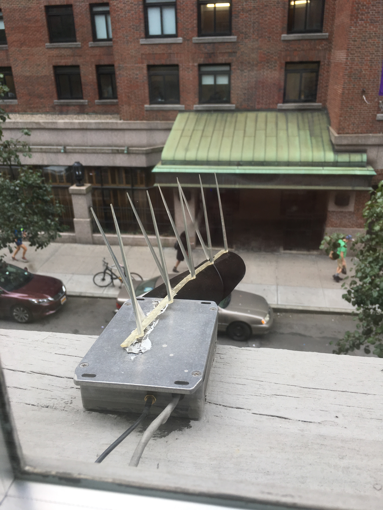
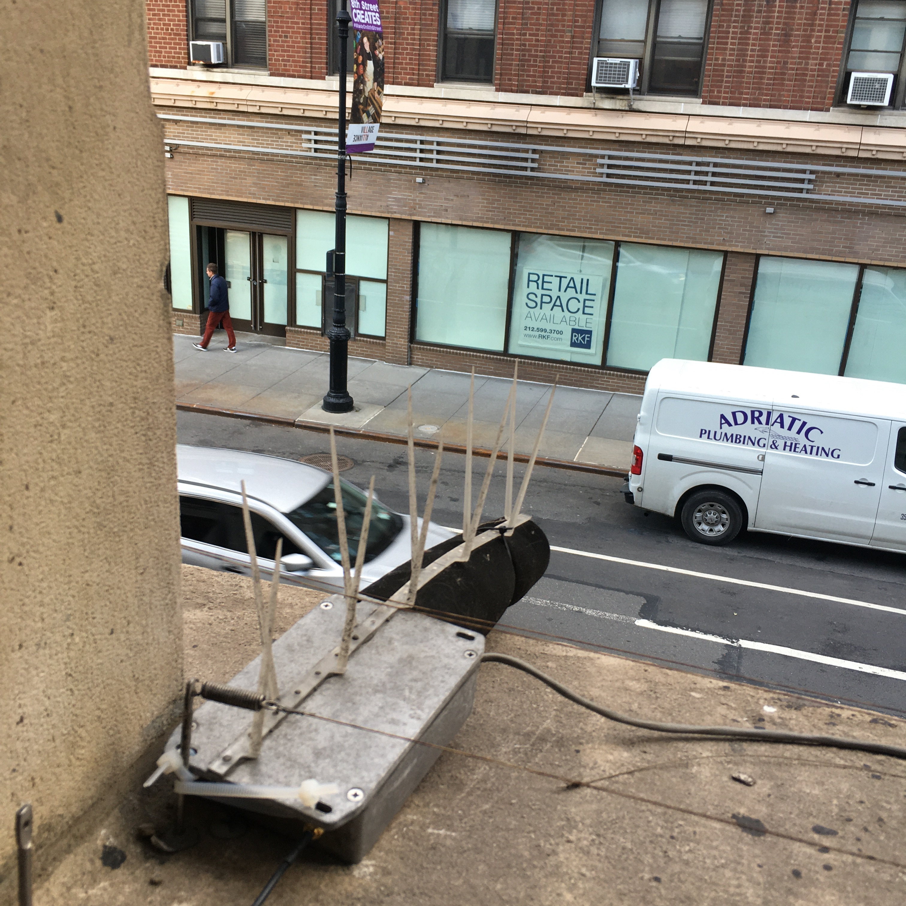
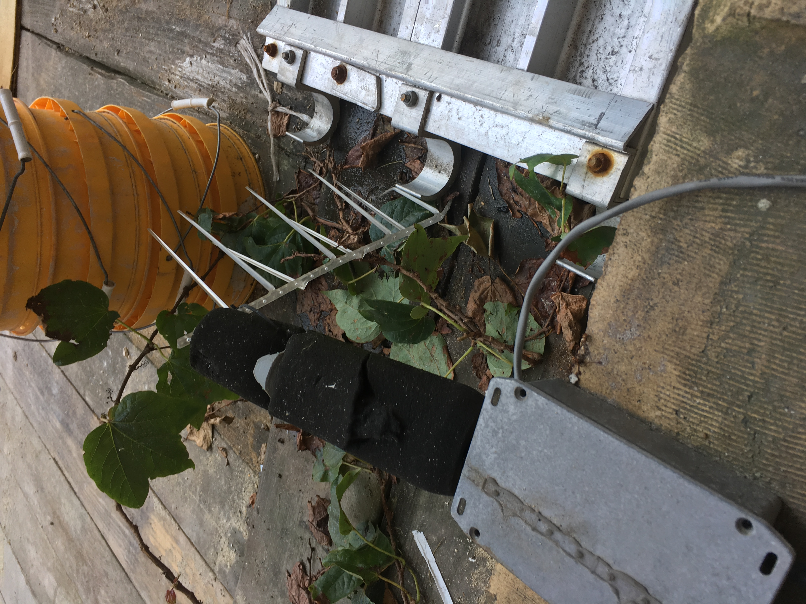

# SONYC Sensor Network Repair Findings

# Table of Contents

1. [Introduction to the SONYC Sensor Network](https://github.com/sonyc-project/Sensor-Repair-Log-Findings-/blob/main/README.md#introduction-to-the-sonyc-sensor-network) 
2. [Sensor Engineer](https://github.com/sonyc-project/Sensor-Repair-Log-Findings-/blob/main/README.md#sensor-engineer)
3. [Report Introduction](https://github.com/sonyc-project/Sensor-Repair-Log-Findings-/blob/main/README.md#my-report)

## Introduction to the SONYC Sensor Network
The SONYC (Sounds of New York City) project is a noise pollution research project run by scientists at New York University in collaboration with Ohio State University and funded by the National Science Foundation. A link to the project's website can be found [here](https://wp.nyu.edu/sonyc/).

The sensors are deployed in various buildings and parks throughout New York City to monitor the noise level. These sensors contain a microphone that collects the loudness level in decibels (dB) over time. We are  able to access this information as well as more statistics about the state and performance of the sensor. This is crutial for knowing when sensors need repairing or updating of components.

This is what a healthy sensor looks like. They are often placed outside of windows pointing at the street below.
 

Some sensors are even placed in busier locations.

 

## Sensor Engineer 
As a sensor engineer, I am responsible for building, maintaining and repairing the sensor network. This includes making visits to these sensors and repairing them on site. Often-times it is too difficult to remove the sensor from it's mounting to make a repair in the lab. 

These repairs include but are not limited to electronics failures, wifi failures, power unplugged from the wall, or even updates to the physical condition of the sensors. 

Since the sensors are outside in all forms of weather, it is not foreign for them to collect dirt, fuzz or hair. This is an example of a sensor that has collected dirt over time.

It's not uncommon that birds will pick at the windscreen of the sensors. This results in pieces missing from the screens. Missing or malfunctionioning screens contaminate the dB readings as well as put the components of the microphone at higher risk of water and other types of physical damage.

In this sensor's case, the bird spikes (designed to keep birds from picking at the foam) has been torn off, resulting in the windscreen ripping.

These sensors are exposed to all weather conditions.  

All of these conditions have their own unique effects on the performance of the sensors. They also effect how easily and quickly we are able to make repairs.

## Report Introduction

The contents of my report rely on the data collected on the state of the sensors. When an engineer goes to a location and makes a repair, we mark the repair down in a form. This way, we can keep track of which sensors are failing and how they are failing. This helps us both to develope a method for diagnosing sensors on site and for thinking of things that could increase the up-time of the network as a whole. 

I was able to analyze all of the sensor repair logs from June of 2019 through September of 2020 to see what the most common faults were throughout the network. This report describes that as well as proposed component updates. 
