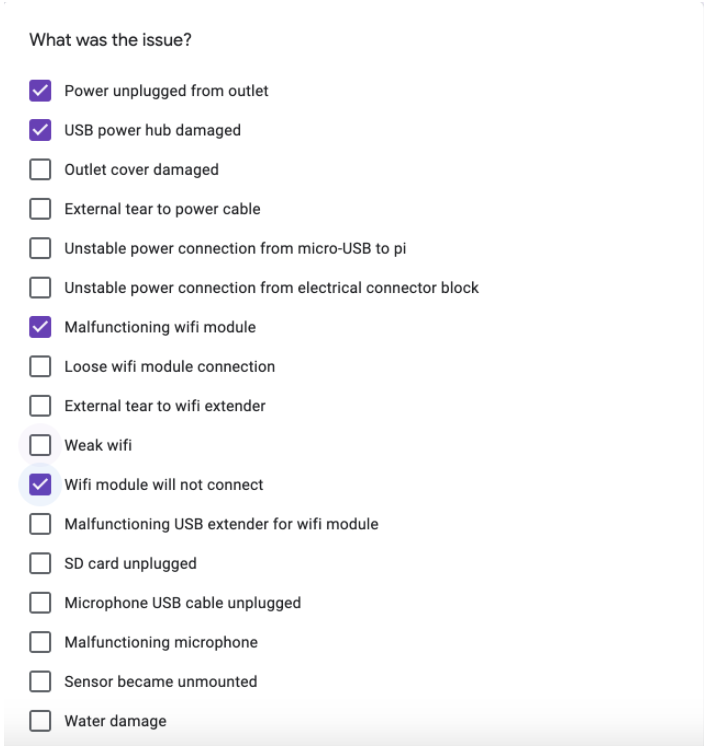
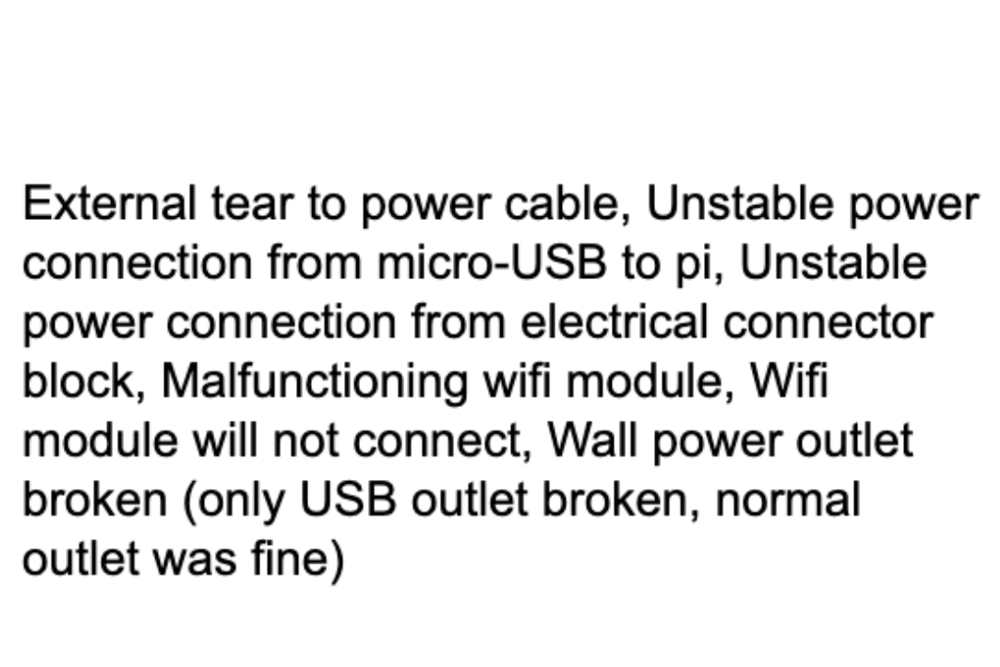
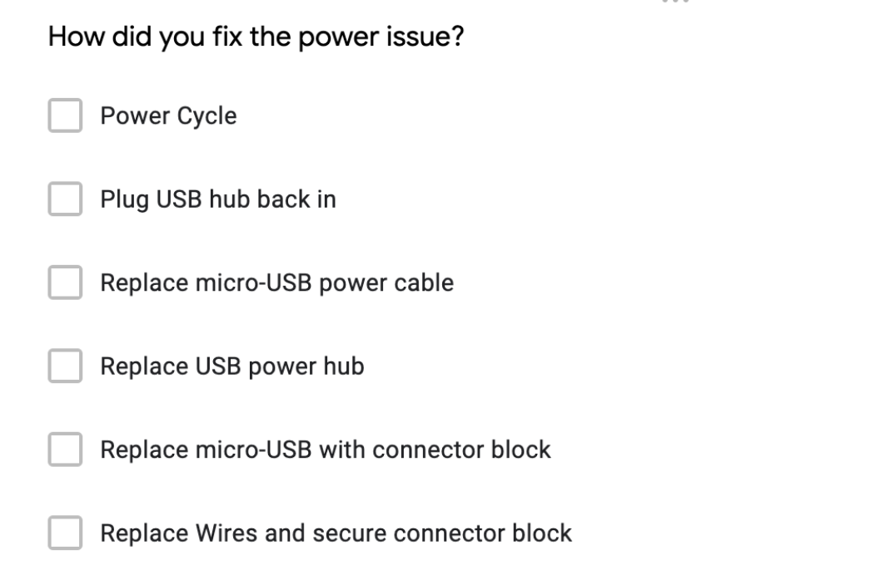
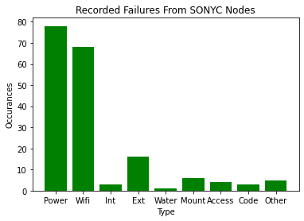
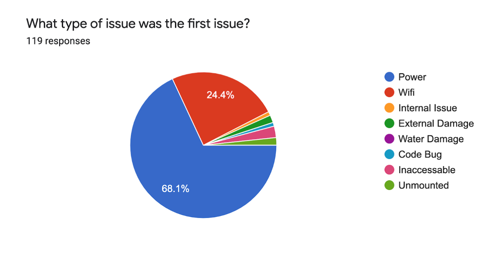
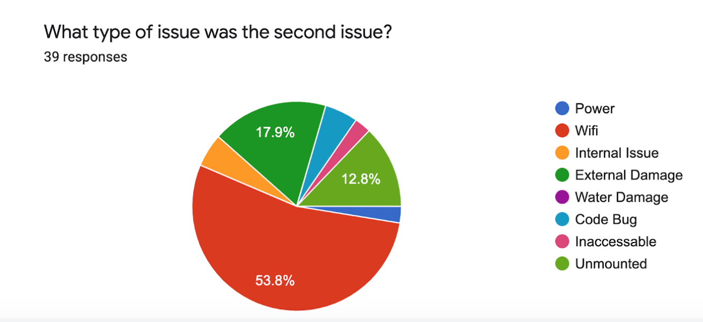
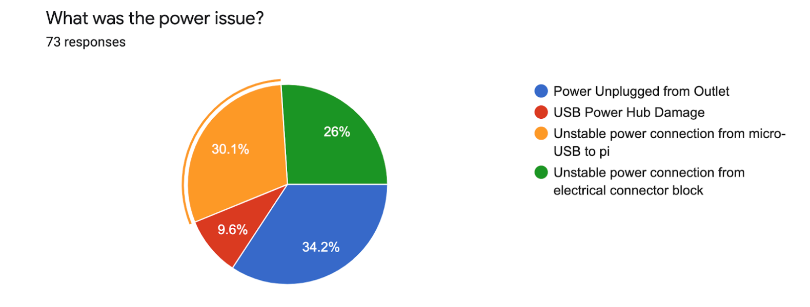
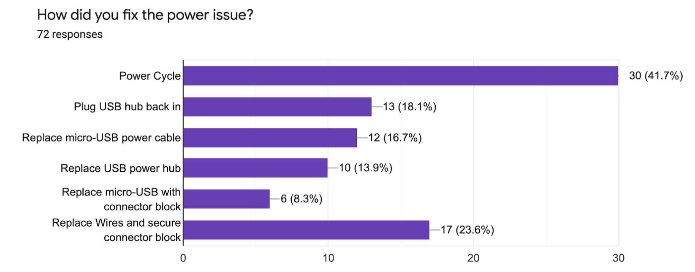

# SONYC Sensor Network Report

# Table of Contents

1. [Introduction to the SONYC Sensor Network](https://github.com/sonyc-project/Sensor-Repair-Log-Findings-/blob/main/README.md#introduction-to-the-sonyc-sensor-network) 
2. [Sensor Engineer](https://github.com/sonyc-project/Sensor-Repair-Log-Findings-/blob/main/README.md#sensor-engineer)
3. [Report Introduction](https://github.com/sonyc-project/Sensor-Repair-Log-Findings-/blob/main/README.md#report-introduction)

## Introduction to the SONYC Sensor Network
The SONYC (Sounds of New York City) project is a noise pollution research project run by scientists at New York University in collaboration with Ohio State University and funded by the National Science Foundation. A link to the project's website can be found [here](https://wp.nyu.edu/sonyc/).

The sensors are deployed in various buildings and parks throughout New York City to monitor the noise level. These sensors contain a microphone that collects the loudness level in decibels (dB) over time. We are  able to access this information as well as more statistics about the state and performance of the sensor. This is crutial for knowing when sensors need repairing or updating of components.

This is what a healthy sensor looks like. They are often placed outside of windows pointing at the street below.
 

Some sensors are even placed in busier locations.

 

## Sensor Engineer 
As a sensor engineer, I am responsible for building, maintaining and repairing the sensor network. This includes making visits to these sensors and repairing them on site. Often-times it is too difficult to remove the sensor from it's mounting to make a repair in the lab. 

These repairs include but are not limited to electronics failures, wifi failures, power unplugged from the wall, or even updates to the physical condition of the sensors. 

Since the sensors are outside in all forms of weather, it is not foreign for them to collect dirt, fuzz or hair. This is an example of a sensor that has collected dirt over time.

It's not uncommon that birds will pick at the windscreen of the sensors. This results in pieces missing from the screens. Missing or malfunctionioning screens contaminate the dB readings as well as put the components of the microphone at higher risk of water and other types of physical damage.

In this sensor's case, the bird spikes (designed to keep birds from picking at the foam) has been torn off, resulting in the windscreen ripping.

These sensors are exposed to all weather conditions.  

All of these conditions have their own unique effects on the performance of the sensors. They also effect how easily and quickly we are able to make repairs.

## Report Introduction

The contents of my report rely on the data collected on the state of the sensors. When an engineer goes to a location and makes a repair, we mark the repair down in a form. This way, we can keep track of which sensors are failing and how they are failing. This helps us both to develope a method for diagnosing sensors on site and for thinking of things that could increase the up-time of the network as a whole. 

I was able to analyze all of the sensor repair logs from June of 2019 through September of 2020 to see what the most common faults were throughout the network. This report describes that as well as proposed component updates. 

# SONYC Network Repair Findings

The data comes from the original “Sensor Maintenance Log”. This log is where sensor engineers record sensor faults during each visit. Sensor FQDN, location, faults and fixes are all recorded in this form as well as how long each sensor took to fix. 
  
  
The original form gave the engineer the option to check off as many problems as needed on the form. Below is an example of the faults section of the form filled out. This is how an engineer would typically fill out the form when there appears to be more than one fault on a single sensor visit. 

As I was compiling all of the data on the google sheet, I recognised that there was not enough consistency in the wording of the data to make it easily machine readable. For example, some of the faults would have written in entries, making it very difficult to create a machine-readable algorithm to visualize the data. Below is an entry from the “Sensor Maintenance Log” sheet that shows this. 

The wording of this entry is not consistent enough with the choices on the form to even be able to group it by keyword. I decided that there should be a way to enter the data in a more detailed and machine-readable format. This is how I created my new version of the repair log. I looked through all of the previous data and found that all of the entries fit into one of 8 categories. Those include power, wifi, Internal Issues, External issues, Water Damage, Code Bug, Inaccessible, or unmounted. 

## The repair form 

The new form has multiple sections. It records basic data about the sensor such as FQDN, sensor location and how long each sensor took to fix. From there, you chose what category the issue falls into. From there, the form allows you to choose the specific type of problem and insert how you fixed it. This is an example of the faults under the “power” section.

From there, you are able to choose multiple solutions that were tried. 

Every issue that has ever been recorded for sensor faults have been added to the form so that there will be very little to no manually inputted information. [This](https://docs.google.com/forms/d/e/1FAIpQLSeATP-bJxwGx6i4iKsI8ZUBbZUIgp5vGD5cxFJVBOkFfjHiTA/viewform) form also allows users to enter multiple faults per visit. This is the link to the updated google form. 

I manually transferred all of the entries from the old form to the updated one. All of this data can be found on a google sheet linked to the form. This sheet is organized into categories; there is basic information, one section for each fault, as well as one section for each category. This is all color-coded to make it easily readable. That sheet can be found [here](https://docs.google.com/document/d/1yfAyODgW51rM1zO6KKSXv8NAcIRup3mCLfKhxZ47HNM/edit). 

In doing all of this data transferring, I was able to make observations about the sensor network as a whole. Since each individual fault is entered separately, the most frequently recorded fault can be seen, but there is also data that shows which type of fault is typically entered first during a visit. This can be seen based on which order it is listed on the original repair log google sheet.

## Common Network Faults

_This chart represents overall fault numbers._

This shows that the most common fault recorded is under the ‘power’ category. This is closely followed by ‘wifi’ faults. This can also be seen when you look at which faults are commonly recorded first in a visit. ‘Power’ faults are more commonly recorded first during a sensor visit. The second fault typically recorded is ‘wifi’, which follows the chart above. 

This shows that power faults are not only the most common faults, but typically the first fault noticed during a sensor visit. 

## Power Faults

The most common overall fault in the sensor network is under the power category as well. The most common fault is ‘power unplugged from outlet’ (25 times recorded), followed by ‘unstable power connection from micro-USB to pi’ (22 times recorded), which is the second most common fault in the overall sensor network. This can be seen here. 

Because power being unplugged is the most common fault, the most common fix during any sensor visit is a power cycle. 

## Visit Time

If you look at the percent of visits that are power related (78 of the 184 recorded [42.39%]) and the number of power visits that only require a power cycle (41.7% of power visits), it can be concluded that the ability to remotely power cycle sensors would reduce sensor visits by 17.7%. Based on the recorded repair log hours, this would save roughly 263 minutes of sensor engineer time. This is calculated by taking the total time recorded (1485 minutes) and 17.7% of that. 

